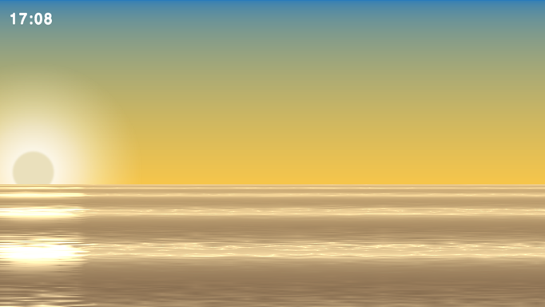
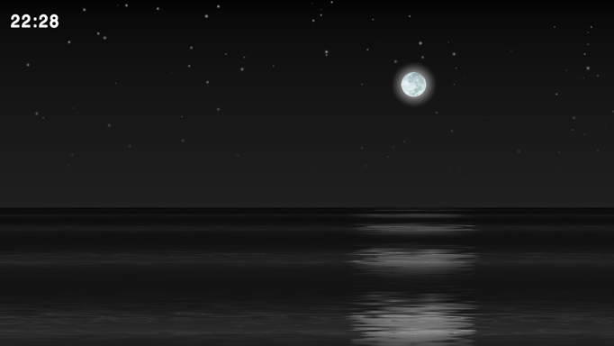

# Dawn
This is a tech demo showing how to develop custom graphic effects in [ejoy2d](https://github.com/ejoy/ejoy2d). This project is inspired by HGE's demo [The Big Calm](http://hge.relishgames.com/doc/index.html?tutorials_tut08.html).

Here is the screenshots:

## Build
### 1. Export Resource
	* cd res
	* ./export.sh
### 2. Build App
#### For IOS
	* open build/ios/dawn.xcodeproj with xcode
	* command + r
#### For Android (on macosx)
	* install jdk, android sdk, android ndk, ant
	* connect device or launch simulator
	* cd build/android
	* ./build

## Install from market
* IOS: not available currently
* Android: [GooglePlay](https://play.google.com/store/apps/details?id=com.poags.dawn)

**NOTICE: You can do everything with the source code but please do NOT submit compiled package to appstore or googleplay directly!**

## About ejoy2d
Ejoy2d is a open source cross-platform 2d game engine. The engine is written in c but provides a efficient lua binding. Check the [homepage](https://github.com/ejoy/ejoy2d) for more information.

## About resource packing
Ejoy2d does not support creating sprite from image file, so we must pack all assets to a package with specific format. [Simplepacker](https://github.com/skykapok/simplepacker) is a easy way to do this work.